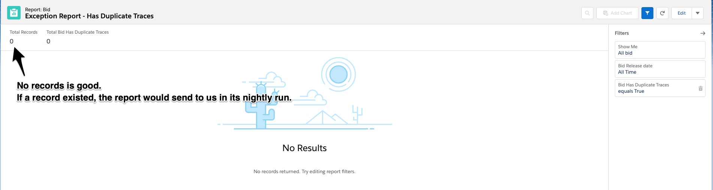
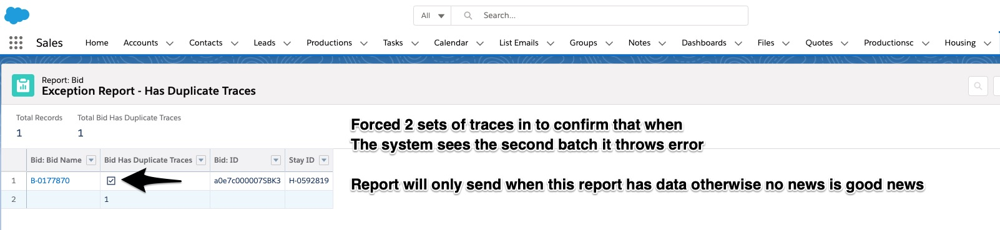
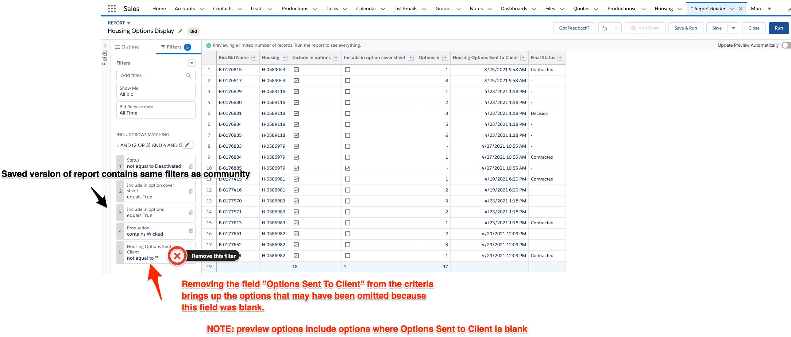

# Quality Assurance

<hr>
Several Quality checks can be done to proactively find things that are problematic.  These include running Automated Tests, and watching reports to see if we can spot a data condition that would tell us something is broken.   

The categories for QA focused on in the Voyajer system are:
* *Automated Tests* - These are required to be written to deploy regardless, but Apex Unit tests that specifically setup data to replicate speciifc scenarios is a time investment that can make a huge difference.  When written properly and brainstormed these can be an autoamtic way to check for regression issues that your deployment created, and how your code will behave in Production
* *Exception Reports* - These reports will only email us when they return data,  and allow meaningful emails to alert us to problems.  They are normal reports which can be viewed on demand but also will run on a schedule to have some type of automated checks in place.

<hr width="50%">

## Exception Reports
### Has Duplicate Traces Report
**Background:** When traces are created (Tasks inserted) we do a check at the end to see if we have more traces than we should for a particular bid.  ** This does not currently include old data, only new records going forward.

**Problem Solved:** Duplicate Traces that might be "sporadic" would notify us and be less mysterious. 
#### Details
  * **Scheduled:**  Nightly 2am
  * **Filter**: 
    * Has_Duplicate_Traces__c on the Bid__c record is TRUE
  * **Link:** [Has Duplicate Traces Report](https://roadrebel.lightning.force.com/lightning/r/Report/00O3w000005zJHzEAM/edit)

#### Screenshots 
  * **Non Exception State**
  * **Exception State**

<hr>

### View Options for Stay
**Background:** When the options are sent to the client from the dashboard, there are a few criteria for the data for it to show the client.  This report has the fields from the query so we can figure out what condition it didn't meet.


**Problem Solved:** An answer to a missing option can be narrowed down and not have the wait time on dev resources.
#### Details
  * **Scheduled:**  Run on Demand
  * **Filter**: 
```
      FROM Bid__c
      WHERE
        Housing__c = :housingId
        AND Status__c != 'Deactivated Bid'
        AND Housing__r.Options_sent_to_client__c != NULL
        AND (Include_in_options__c = TRUE
        OR Include_in_option_cover_sheet__c = TRUE)
      ORDER BY Options__c ASC
```
The query is doing the following:
* Status not Deactivated Bid
* The Options Sent to Client field on the stay is not blank (timestamp exists)
* Include in Options OR Include in Option Cover Sheet fields are true  
* **Link:** [Option Details Report (edit filters to troubleshoot)](https://roadrebel.lightning.force.com/lightning/r/Report/00O3w000005zK6TEAU/edit)

#### Screenshots 
  * **Non Exception State (What you see as results is what Community would bring back)**
<hr>


## Automated Tests
