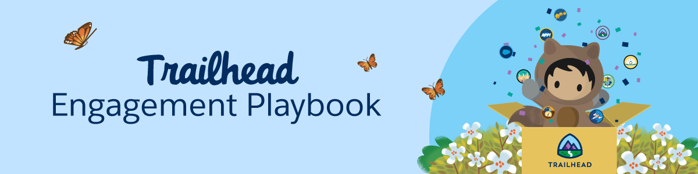

## Trailhead Engagement Playbook

**Identify learning opportunities(use cases) across your organization.** 

* Digital Transformation
* New Salesforce Roll-out
* Investment in Employee Development
    * New Hire Onboarding
    * Leadership Development
* Key Company Initiatives - Equality, Wellness

**Figure out how you will motivate employees to skill up. Below are a few methods that Salesforce and many of our customers have used to drive Trailhead engagement.**

* A fun Trailhead Challenge is a very effective way to kick off your initial Trailhead engagement, ie) reward your top badge earners after a 6-week Trailhead learning adventure! 
    * We’ve also seen successful challenges that last 3 months, 6 months, 12 months. It’s up to you! 
* Rank Challenge - Identify a [rank](https://trailhead.salesforce.com/en/trailblazer-ranks)for your learners to achieve or challenge them to level up to higher rank(s).
* Promotion Criteria - Employees must complete specific Trails, Modules, etc. or achieve a certain [Trailhead rank](https://trailhead.salesforce.com/en/trailblazer-ranks)in order to be considered for promotion. 
* Completion of a specific Trail, Module, or Trailmix prior to an event

[Image: Screen Shot 2021-03-12 at 3.12.53 PM.png]

**Define the details of your own Trailhead Challenge to kick off your organization's learning adventure** 

* Who can earn the most Trailhead badges in 6 weeks? Six weeks is the perfect amount of time to allow for participants to thoroughly engage with the content and still focus on their core job.
    * Define the timeframe that works best for your organization. We’ve also seen Challenges last 3, 6, 12 months. It’s up to you! 
* Who can earn the [Trailhead Ranger Rank](https://trailhead.salesforce.com/en/trailblazer-ranks) by a certain date?(Allow at least 3 months)

* Emphasize that the focus should be on *learning*, not merely badge collecting. Winners will be determined by points *_and_* badges to help validate this. 

* Identify a prize or incentive for your Trailhead Challenge. Some ideas below:
    * Emphasize that **the real prize is the learning**, new skills, and professional development.
    * **Recognition**, such as a “Trailblazer Spotlight” and/or opportunity to present their key Trailhead learnings to Leadership
    * **Swag**, such as a [Trailblazer Hoodie](https://trailheadstore.com/), Bose Headphones, Gift Cards, etc. 
    * Donation to charity of choice 

[Image: image.png]
**Approach the Leader of the team to propose a Trailhead Kickoff Session and Challenge**

* Propose the challenge as an investment in team members' professional development
    * [Sample Email to Leader](https://salesforce.quip.com/lIfkAan7tTxl)
    * [Sample Email invite to Trailhead Session](https://salesforce.quip.com/RgegARADe4ff)
* Stats you can use to justify investing time in skilling up on Trailhead:
    * According to a recent LinkedIn study, 94% of employees would stay at their company if they invested in learning.
    * In a recent study by Valoir, 2/3rds of Trailhead Learners say they are more productive because of the skills learned on Trailhead. 

[Image: Quip Divider.jpg]**Create the perfect [Trailmix](https://trailhead.salesforce.com/en/trailmixes) to include as part of the Trailhead Challenge**

* It's easy to create a Trailmix. Anyone with a Trailhead Account can add specific Modules, Trails, etc in to a Trailmix in order to customize a learning journey based on role, level, and interest. 

* Only include Modules/Trails that will be relevant to your target audience and/or reflect the skills that you are looking for them to obtain.[Learn Salesforce with Trailhead](https://trailhead.salesforce.com/en/content/learn/trails/learn_salesforce_with_trailhead) is a great Trail to include
* For more tips on how to create the perfect Trailmix, click [here](https://medium.com/trailhead/bake-the-perfect-trailhead-trailmix-52f3d525c880).

[Image: DJ Astro.png]
**Organize and host a fun Trailhead Kickoff!** 

* [Sample Agenda](https://org62.my.salesforce.com/sfc/p/000000000062/a/0M000000UTdE/CTKy.HkXsbqVnUXaOREmrvBWSn40t6mC2qX5c2bWw3Y)for your meeting
* Bring the **FUN** to your session! 
    * Create a fun virtual background in the theme of Trailhead
    * Create a theme - camping, hiking, choose your own adventure
    * Wear a Ranger hat and [Trailblazer hoodie](https://trailheadstoreamer.com/productlist.aspx?did=31070)
* Check out the [Virtual Meeting Set-up Badge](https://trailhead.salesforce.com/content/learn/modules/virtual-meeting-setup-quick-look?trailmix_creator_id=strailhead&trailmix_slug=trailhead-in-a-box-for-virtual-learning) for great tips!

[Image: Quip Divider.jpg]**Install the free app [Trail Tracker](https://medium.com/trailhead/trailhead-with-trail-tracker-37fcfe82efb5)in order to assign, track, and report on badges earned by your team via pre-built reports and dashboards.**

* Download Trail Tracker for free **[here](https://appexchange.salesforce.com/listingDetail?listingId=a0N3A00000EFpAtUAL).**(Installation Guide and FAQ included)
* Trail Tracker is only effective if all of the learners you are trying to track are signed up to Trailhead via a standard login domain. The best way to ensure this is to have everyone sign up for their new accounts via their Salesforce login.  
* If you have multiple Salesforce orgs, one best practice is to set up a dedicated org for Trailhead learning. Non-licensed users can use Chatter-free licenses or Platform licenses. 
* [How Trailhead with Trail Tracker will Help you Drive Salesforce Adoption](https://medium.com/trailhead/trailhead-with-trail-tracker-37fcfe82efb5)

[Image: Screen Shot 2021-03-12 at 3.31.52 PM.png]
**Motivate your learners throughout your Trailhead Challenge by sharing fun weekly status updates via email, Chatter, Slack, or whichever channel will reach the most people** 

* Highlight top badge earners
* Do Weekly/Monthly Trailhead Ranger Spotlights
* Encourage participants to share their experience with Trailhead
* Copy your Leadership so that participants get recognition
* Announce your winner at a key meeting and/or via email/Chatter/Twitter, etc. Fun prizes can be found on the [Trailhead Store](https://trailheadstoreamer.com/). 

[Image: 10,000 Rangers! .png]
**Keep the momentum going!** 

* Spotlight your Trailblazers and how they are utilizing the skills they've earned with Trailhead
* Publicly recognize Trailblazers who've achieved certain milestones within Trailhead, ie) Superbadge completion, Ranger rank, Certification, etc. 
* Celebrate company/team Trailhead Milestones
    * 1000 badges earned
    * 1000 Rangers! 
* Create friendly cross-team competitions
* Implement the other engagement models listed at the top.

[Image: Quip Divider.jpg]**Engage your Salesforce Account Team. The Trailhead Team is also happy to help. We want you to be successful!** 

## Happy Trailblazing! 

[Image: Astro learning.png]
