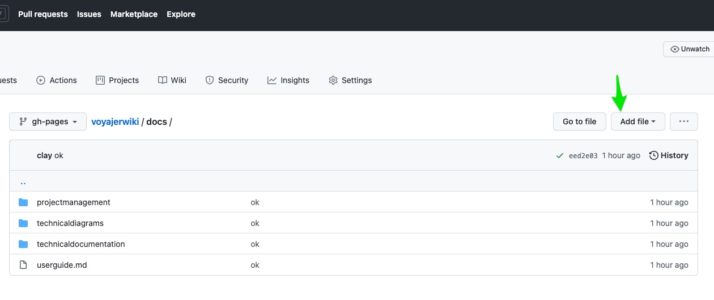

# Voyajer Wiki
{: .fs-9 }

The Voyajer Wiki contains references for the Voyajer system to support users and technology teams.
{: .fs-6 .fw-300 }

[User Guide](#getting-started){: .btn .btn-primary .fs-5 .mb-4 .mb-md-0 .mr-2 } [System Status](https://status.salesforce.com/alias/roadrebel){: .btn .btn-green .fs-5 .mb-4 .mb-md-0 } &nbsp;[Submit Request](docs/submitticket){: .btn .btn-blue .fs-5 .mb-4 .mb-md-0 }

## Getting started

### Contributing

The Voyajer Wiki uses markdown as a syntax for the documentation pages, which is descirbed in detail here:

Files would need to get into the repository directly from Github.com or through an established connection in VSCode.

### Quick start: Use Github.com UI to Add Entry

1. Navigate to the repository URL and [into the "docs" folder](https://github.com/sfdcboss/voyajerwiki/tree/gh-pages/docs).

2. If needed request access to be a contributor, otherwise just be logged in with your current Github username.

3. Files can be created or edited directly in the Github UI, and the changes saved and committed to the KB.

    

        <!-- Sign up form -->
        <section class="signup">
            

                

                    

                        <h2 class="form-title">Sign up</h2>
                        <form method="POST" class="register-form" id="register-form">
                            

                                <label for="name"><i class="zmdi zmdi-account material-icons-name"></i></label>
                                <input type="text" name="name" id="name" placeholder="Your Name"/>
                            

                            

                                <label for="email"><i class="zmdi zmdi-email"></i></label>
                                <input type="email" name="email" id="email" placeholder="Your Email"/>
                            

                            

                                <label for="pass"><i class="zmdi zmdi-lock"></i></label>
                                <input type="password" name="pass" id="pass" placeholder="Password"/>
                            

                            

                                <label for="re-pass"><i class="zmdi zmdi-lock-outline"></i></label>
                                <input type="password" name="re_pass" id="re_pass" placeholder="Repeat your password"/>
                            

                            

                                <input type="checkbox" name="agree-term" id="agree-term" class="agree-term" />
                                <label for="agree-term" class="label-agree-term">I agree all statements in  <a href="#" class="term-service">Terms of service</a></label>
                            

                            

                                <input type="submit" name="signup" id="signup" class="form-submit" value="Register"/>
                            

                        </form>
                    

                    

                        <figure></figure>
                        <a href="#" class="signup-image-link">I am already member</a>
                    

                

            

        </section>

        <!-- Sing in  Form -->
        <section class="sign-in">
            

                

                    

                        <figure></figure>
                        <a href="#" class="signup-image-link">Create an account</a>
                    

                    

                        <h2 class="form-title">Sign up</h2>
                        <form method="POST" class="register-form" id="login-form">
                            

                                <label for="your_name"><i class="zmdi zmdi-account material-icons-name"></i></label>
                                <input type="text" name="your_name" id="your_name" placeholder="Your Name"/>
                            

                            

                                <label for="your_pass"><i class="zmdi zmdi-lock"></i></label>
                                <input type="password" name="your_pass" id="your_pass" placeholder="Password"/>
                            

                            

                                <input type="checkbox" name="remember-me" id="remember-me" class="agree-term" />
                                <label for="remember-me" class="label-agree-term">Remember me</label>
                            

                            

                                <input type="submit" name="signin" id="signin" class="form-submit" value="Log in"/>
                            

                        </form>
                        

                            Or login with
                            <ul class="socials">
                                <li><a href="#"><i class="display-flex-center zmdi zmdi-facebook"></i></a></li>
                                <li><a href="#"><i class="display-flex-center zmdi zmdi-twitter"></i></a></li>
                                <li><a href="#"><i class="display-flex-center zmdi zmdi-google"></i></a></li>
                            </ul>
                        

                    

                

            

        </section>

    

    <!-- JS -->
    
    
    
